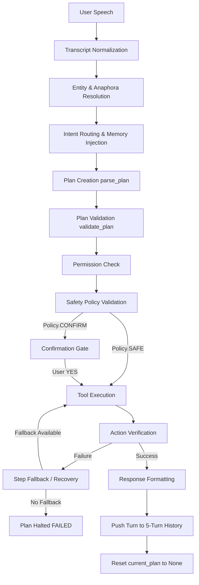

# PHASE 23 DEEP PRODUCT & ARCHITECTURE AUDIT
## Goal-Oriented Personal Assistant Orchestration

---

## Executive Summary

Phase 22 successfully hardened F.R.I.D.A.Y.'s entity resolution, memory systems, failure recovery, and conversational correction. However, F.R.I.D.A.Y.'s execution model remains largely **turn-bound and plan-bound** rather than **goal-bound**. 

This audit evaluates the architectural transition required for **Phase 23: Goal-Oriented Personal Assistant Orchestration**. It defines how F.R.I.D.A.Y. can reliably manage end-to-end user goals across multiple turns, interruptions, failures, and corrections without losing state or repeating destructive actions.

---

## 1. Current Goal Execution Lifecycle & State Leakage Audit

### 1.1 Complete Lifecycle Trace


### 1.2 Critical State Leakage Points Identified

1. **Turn-Boundary Plan Destruction**:
   - `ActionPlan` lives transiently in `ConversationContext.current_plan`.
   - As soon as `plan.state` reaches `COMPLETED`, `FAILED`, or `CANCELLED`, `self.context.current_plan` is set to `None`.
   - Multi-turn goals (e.g., search -> read -> summarize -> answer follow-up questions) lose their overarching goal identity as soon as Turn 1 finishes.
2. **Context Window Expiration**:
   - `ShortTermContext` retains only the last action, last target, last search query, and a rolling 5-turn history.
   - Goal entity references spanning > 5 turns lose focus and default to ambiguous context errors.
3. **Correction Plan Truncation**:
   - When a confirmation request is active (`WAITING_FOR_CONFIRMATION`), an inline correction ("no, open Firefox instead") currently overrides the active single step or discards the remaining queued steps of a multi-step plan.
4. **Recovery State Loss**:
   - If a plan step fails with no configured fallback, `plan.state` becomes `FAILED` and `current_plan` is discarded. The user cannot resume by supplying missing input; they must restate the entire goal from scratch.

---

## 2. Real-World Goal Workflows Analysis

| Workflow | Objective | Current Architectural Capability | State Location | Failure / Interruption Vulnerability |
| :--- | :--- | :--- | :--- | :--- |
| **GOAL A** | *"Find my latest resume and open it."* | **Supported** via `parse_plan()` AND/THEN splitting. | Single `ActionPlan` (2 steps). | None. Runs synchronously in 1 turn. |
| **GOAL B** | *"Search Python internships, read #1 result, tell me requirements."* | **Partial**. Search & read work; synthesis requires multi-turn reasoning. | `ActionPlan` + `ShortTermContext`. | Synthesis step has no explicit goal container. |
| **GOAL C** | *"Remember Python job preference, use preference in search."* | **Partial**. Memory written to SQLite; lookup works on next turn. | SQLite DB (`memories`) + Router. | Memory lookup occurs at route time, not dynamically during step execution. |
| **GOAL D** | *"Find resume, open it; if that fails, find second-most-recent copy."* | **Supported** via static step fallback dictionaries. | `ActionPlan.fallbacks`. | Dynamic branching across multi-step file searches is restricted to static fallback lists. |
| **GOAL E** | *"Search company, read site, summarize, answer follow-up questions."* | **Broken Across Turns**. Turn 1 completes; `current_plan` cleared. | 5-turn history buffer. | Turn 2 follow-ups lose company entity context once plan clears. |
| **GOAL F** | *"Open Chrome, search X; if I say no, search Y instead."* | **Broken On Correction**. Confirmation handles YES/NO for single step. | `ConversationState`. | Saying "no, search Y" cancels plan or replaces step 1, dropping step 2. |

---

## 3. Proposed Goal State Model (`GoalContext`)

To solve multi-turn goal state leakage without overloading `ActionPlan`, we propose introducing `GoalContext`:

```python
@dataclass
class GoalContext:
    goal_id: str                      # Unique UUID for the overall goal
    objective: str                    # Original user goal transcript ("Research Company X")
    state: GoalState                  # IN_PROGRESS, WAITING_FOR_USER, COMPLETED, PAUSED, FAILED
    active_plan: Optional[ActionPlan] # Current operational plan
    completed_steps: list[dict]       # Executed step records + idempotency keys
    pending_steps: list[Intent]       # Remaining queued intents
    entities: dict[str, Any]          # Goal entity store (urls, files, queries, app handles)
    user_corrections: list[dict]      # Tracked inline corrections
    idempotency_keys: set[str]        # Set of executed step fingerprints
    created_at: float                 # Timestamp
    updated_at: float                 # Timestamp
```

### Architectural Justification
`GoalContext` acts as the persistent parent boundary for multi-turn user objectives, while `ActionPlan` remains the low-level, step-by-step execution pipeline for a specific phase of that goal.

---

## 4. Plan vs. Goal Hierarchy Separation

```
┌────────────────────────────────────────────────────────────────────────┐
│                              GoalContext                               │
│  (Parent boundary: tracks objective, accumulated entities, idempotency)│
└───────────────────────────────────┬────────────────────────────────────┘
                                    │
                                    ▼
┌────────────────────────────────────────────────────────────────────────┐
│                              ActionPlan                                │
│        (Operational phase: sequence of executable step intents)        │
└───────────────────────────────────┬────────────────────────────────────┘
                                    │
                                    ▼
┌────────────────────────────────────────────────────────────────────────┐
│                               PlanSteps                                │
│               (Individual Intent + Step Fallback Candidates)           │
└───────────────────────────────────┬────────────────────────────────────┘
                                    │
                                    ▼
┌────────────────────────────────────────────────────────────────────────┐
│                           Tool Executions                              │
│              (Atomic operations routed via registry)                   │
└────────────────────────────────────────────────────────────────────────┘
```

---

## 5. Interruption, Resume, and Idempotency Architecture

### 5.1 Action Idempotency Classification

| Action Type | Examples | Idempotency Profile | Goal Resume Strategy |
| :--- | :--- | :--- | :--- |
| **Pure Idempotent** | `GET_TIME`, `SEARCH_WEB`, `READ_WEBSITE`, `FIND_FILE` | **Safe** | Re-run if output is missing from goal entity cache. |
| **State-Sensitive** | `OPEN_APP`, `OPEN_FOLDER`, `OPEN_FILE` | **Conditionally Safe** | Check if app/file/folder is already open before executing. |
| **Destructive / Non-Idempotent** | `CLOSE_APP`, `DELETE_FILE`, `FORGET`, `WRITE_FILE` | **UNSAFE** | **NEVER** re-execute on goal resume; check `idempotency_keys`. |

### 5.2 Resumption Safety Invariant
> **Critical Invariant**: A resumed goal MUST check its `idempotency_keys` log before executing any step. Destructive actions marked as completed in `completed_steps` are skipped automatically.

---

## 6. Goal-Level Observability

The audit logging system will be enhanced to trace goal execution without logging PII:

```json
{
  "timestamp": "2026-08-15T16:35:00Z",
  "goal_id": "g-8a2f-1234",
  "plan_id": "p-9c3b-5678",
  "step_index": 1,
  "action": "OPEN_APP",
  "target_sanitized": "chrome",
  "policy_result": "SAFE",
  "permission_granted": true,
  "confirmation_required": false,
  "execution_status": "SUCCESS",
  "verification_status": "PASSED",
  "latency_ms": 1.24,
  "idempotency_key": "step_1_OPEN_APP_chrome"
}
```

---

## 7. Local-First & Performance Constraints

1. **Zero Cloud Dependency**: Goal state management operates 100% deterministically in Python using local SQLite and in-memory structures.
2. **Zero Framework Bloat**: Custom lightweight dataclass-based `GoalContext` (no LangChain, AutoGPT, or heavy agent frameworks).
3. **Deterministic Latency**:
   - `GoalContext` creation & state transition: `< 1.0 ms`.
   - Plan step execution & idempotency check: `< 2.0 ms`.
   - Ollama invoked ONLY for open-ended text summarization/synthesis, NEVER for goal state machine logic.

---

## 8. Security & Threat Modeling

| Threat Vector | Attack Scenario | Mitigation Architecture |
| :--- | :--- | :--- |
| **Goal Injection** | Crafting transcript to inject hidden secondary goals | Strict intent parser boundary; single objective per `GoalContext`. |
| **Entity Poisoning** | Malicious web page title hijacking anaphora `it` | Sanitize resolved entities before feeding to context. |
| **Replay Cascade** | Re-executing `CLOSE_APP` on goal resume | Enforce `idempotency_keys` checks for non-idempotent actions. |
| **Cross-Goal Leakage** | New goal accessing prior goal's pending confirmation | Wiping `GoalContext` state on session reset or new goal start. |

---

## 9. Final Audit Verdict

The current F.R.I.D.A.Y. architecture has strong single-turn plan execution and safety controls, but requires the `GoalContext` abstraction to support multi-turn goals, goal resumption, and idempotency tracking.

Proceed with Phase 23 implementation plan upon user approval.
