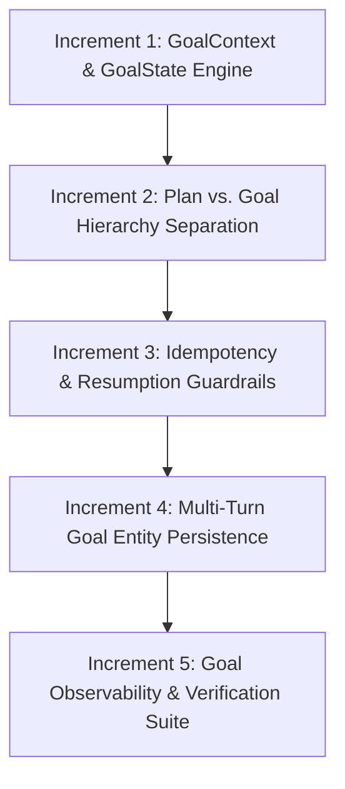

# Implementation Plan — Phase 23: Goal-Oriented Personal Assistant Orchestration

Phase 23 introduces **Goal-Oriented Orchestration** to F.R.I.D.A.Y. v2. It decouples high-level user goals from single-turn action plans by introducing `GoalContext`, multi-turn goal state persistence, idempotency tracking for non-idempotent actions, and goal resumption capabilities.

> [!IMPORTANT]
> - **NO production code changes** will be executed during this planning phase.
> - `dry_run=True` and `allow_real_execution=False` safety defaults remain 100% enforced.
> - Local-first constraints remain strictly active (0 cloud LLM calls, 0 heavy external frameworks).

---

## Priority-Ranked Phase 23 Initiatives

---

## Proposed Changes & Architectural Increments

### Component 1: Goal Context Engine
#### [NEW] [goal_models.py](file:///c:/Users/abhin/Personal/F.R.I.D.A.Y%20v2/friday/planning/goal_models.py)
- Create `GoalState` enum: `IDLE`, `IN_PROGRESS`, `WAITING_FOR_USER`, `COMPLETED`, `PAUSED`, `FAILED`.
- Create `GoalContext` dataclass:
  - `goal_id`, `objective`, `state`, `active_plan`, `completed_steps`, `pending_steps`, `entities`, `user_corrections`, `idempotency_keys`, `created_at`, `updated_at`.

### Component 2: Hierarchy Separation & Manager Integration
#### [MODIFY] [conversation.py](file:///c:/Users/abhin/Personal/F.R.I.D.A.Y%20v2/friday/core/conversation.py)
- Integrate `GoalContext` into `ConversationContext`.
- Preserve `GoalContext` across multi-turn exchanges until explicitly completed or cancelled.
- Route turn transcripts through active `GoalContext` before creating a new plan.

### Component 3: Idempotency & Resumption Safety
#### [MODIFY] [executor.py](file:///c:/Users/abhin/Personal/F.R.I.D.A.Y%20v2/friday/planning/executor.py)
- Add idempotency check prior to executing any plan step:
  - Check step fingerprint against `GoalContext.idempotency_keys`.
  - Block accidental re-execution of destructive actions (`CLOSE_APP`, `DELETE_FILE`, `FORGET`, `WRITE_FILE`) upon goal resumption.

### Component 4: Multi-Turn Entity Accumulator
#### [MODIFY] [context_resolver.py](file:///c:/Users/abhin/Personal/F.R.I.D.A.Y%20v2/friday/planning/context_resolver.py)
- Bind entity resolution to `GoalContext.entities` in addition to rolling `ShortTermContext`.
- Ensure multi-turn follow-ups (e.g. Goal E: search -> read -> summarize -> ask follow-up questions) resolve entities accurately across 5+ turns.

---

## Verification & Testing Strategy

### 1. Goal Lifecycle Suite
- `tests/test_phase23_goal_lifecycle.py`: Test goal creation, turn-to-turn entity retention, paused state, and completion.

### 2. Idempotency & Resumption Suite
- `tests/test_phase23_idempotency.py`: Test goal interruption/resume with zero re-execution of destructive steps (`CLOSE_APP`, `DELETE_FILE`).

### 3. Workflow Regression Suite
- `tests/test_phase23_workflows.py`: Verify Workflows A through F end-to-end.

---

## Performance & Security Implications

- **Performance**: Goal context operations operate in-memory (< 1.0 ms overhead). Zero Ollama calls for goal state transitions.
- **Security**: Goal state isolation prevents cross-session leakage; idempotency keys prevent replay attacks.
