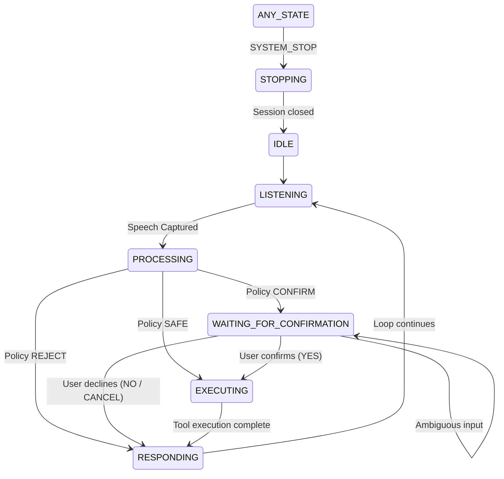

# Phase 4 Implementation Plan: Conversation State + System Commands + Robust Command Understanding

This document outlines the design and plan for Phase 4 of F.R.I.D.A.Y. v2, connecting conversation state, system intents, robust target resolution, and state-aware confirmation while keeping dry-run safety gates active.

---

## 1. Current Architecture Overview

Currently, the pipeline consists of:
- **Audio Capture & VAD**: `AudioInput` + `VoiceActivityDetector` + `VoiceSessionManager`.
- **STT**: `SpeechToText` (`faster-whisper small.en` on CPU `int8`, beam_size=1).
- **Text Normalizer**: `friday.intent.normalizer.normalize()` (lowercase, punctuation, whitespace).
- **Target Resolver**: `friday.intent.resolver.resolve_app()` and `resolve_website()` using `difflib`.
- **Intent Router**: `friday.intent.router.route()` mapping raw text to structured `Intent`.
- **Safety Validator**: `friday.safety.validator.validate()` mapping `Intent` to `Policy` (`SAFE`, `CONFIRM`, `REJECT`).
- **Confirmation Prompt**: Console prompt `request_confirmation()` in `friday/safety/confirmation.py`.
- **Tool Registry**: `friday.tools.registry.execute()` executing actions with dual safety gates (`dry_run=True`, `allow_real_execution=False`).

---

## 2. Existing Reusable Components

The following existing components will be reused directly without breaking changes:
- `VoiceSessionManager` (persistent mic lifecycle, drain, VAD, STT).
- `SpeechToText` and `VoiceActivityDetector`.
- `Intent` and `Action` model hierarchy (`friday/intent/models.py`).
- `normalize()` (`friday/intent/normalizer.py`).
- `resolve_app()` / `resolve_website()` (`friday/intent/resolver.py`).
- `compute()` confidence propagation (`friday/intent/confidence.py`).
- `validate()` safety thresholds (`friday/safety/validator.py`).
- Tool modules (`apps.py`, `browser.py`, `files.py`, `system.py`, `registry.py`).
- Dual safety gates in `config.yaml` (`dry_run: true`, `allow_real_execution: false`).

---

## 3. Proposed Conversation State Machine

An explicit state machine will manage conversation flow without scattered boolean flags.

### States (`ConversationState` enum in `friday/core/state.py`):
1. `IDLE`: Initial state before listening starts.
2. `LISTENING`: Session listening for user speech input.
3. `PROCESSING`: Transcribing, routing, and validating intent.
4. `WAITING_FOR_CONFIRMATION`: Pending intent stored, waiting for user confirmation (YES/NO/CANCEL).
5. `EXECUTING`: Validated or confirmed intent dispatching to tool registry (DRY RUN).
6. `RESPONDING`: Formulating and printing assistant response.
7. `STOPPING`: Cleanly shutting down session.

### State Transitions:

---

## 4. System Intents

New `Action` enum entries added to `friday/intent/models.py`:
- `SYSTEM_STOP`: Triggers session shutdown (`STOPPING` state).
- `SYSTEM_CANCEL`: Cancels pending action if in `WAITING_FOR_CONFIRMATION`, or returns "Nothing to cancel".
- `SYSTEM_HELP`: Returns standard capabilities message.
- `SYSTEM_REPEAT`: Repeats the last assistant response.

### Router Patterns:
- `stop`, `exit`, `quit`, `shut down`, `goodbye` → `SYSTEM_STOP` (confidence: 1.0)
- `cancel`, `never mind`, `nevermind`, `abort` → `SYSTEM_CANCEL` (confidence: 1.0)
- `help`, `what can you do`, `options`, `commands` → `SYSTEM_HELP` (confidence: 1.0)
- `repeat`, `say that again`, `pardon`, `what did you say` → `SYSTEM_REPEAT` (confidence: 1.0)

System intents bypass application tools and are handled directly by the conversation manager.

---

## 5. Conversation Context Model

A lightweight session context `ConversationContext` stored in `friday/core/conversation.py`:
- `state`: `ConversationState`
- `last_transcript`: `str`
- `last_intent`: `Intent | None`
- `last_response`: `str`
- `pending_intent`: `Intent | None`

### Context Rules:
- Pending action is saved only when state enters `WAITING_FOR_CONFIRMATION`.
- When in `WAITING_FOR_CONFIRMATION`, incoming text is evaluated first for confirmation or system commands.
- If confirmed ("yes"), `pending_intent` is executed directly without re-running STT interpretation on the word "yes".
- "yes" outside `WAITING_FOR_CONFIRMATION` does nothing (evaluated as normal command → `UNKNOWN`).

---

## 6. Confirmation Flow

Reusable confirmation logic in `friday/safety/confirmation.py`:
- `parse_confirmation_response(transcript: str) -> bool | None`:
  - `True`: `yes`, `y`, `yeah`, `yep`, `yup`, `correct`, `that's right`, `do it`, `go ahead`
  - `False`: `no`, `n`, `nope`, `wrong`, `not that`, `cancel`, `abort`
  - `None`: ambiguous / unrecognised response (remains `WAITING_FOR_CONFIRMATION`).

---

## 7. Command & Target Resolution Improvements

### Target Resolution (`friday/intent/resolver.py`):
- Explicit phonetic aliases with controlled confidence:
  - `chrome`: `chrome`, `google chrome`, `groan`, `groom`, `grove` (phonetic candidates return `0.55` confidence → `CONFIRM`).
  - `vscode`: `vscode`, `vs code`, `visual studio code`, `code`.
- Strict rejection of unrelated / hallucinated speech:
  - `"blood growing"`, `"million dollars"`, `"i hope and you do"`, `"slowest youtube"`, `"and grown"`, `"and it was chrome"` → `UNKNOWN` / `REJECT`.

### File Query Robustness (`friday/tools/files.py`):
- If `find_file` produces 0 matches in safe directories (Desktop, Documents, Downloads), return `"No exact matches found for '<query>'."` without searching outside safe folders.

---

## 8. Safety Guarantees & Invariants

1. **INVARIANT 1**: Raw transcript can never directly execute a shell/tool command.
2. **INVARIANT 2**: `UNKNOWN` can never execute a tool.
3. **INVARIANT 3**: Low confidence (< 0.45) can never execute a tool.
4. **INVARIANT 4**: `CLOSE_APP` always requires confirmation (`Policy.CONFIRM`).
5. **INVARIANT 5**: Real execution remains disabled (`dry_run: true`, `allow_real_execution: false`).
6. **INVARIANT 6**: Confirmation must execute a stored `pending_intent`.
7. **INVARIANT 7**: "yes" cannot execute anything unless `state == WAITING_FOR_CONFIRMATION`.
8. **INVARIANT 8**: "stop" exits voice session cleanly without touching application tools.
9. **INVARIANT 9**: "cancel" cancels pending action without touching application tools.
10. **INVARIANT 10**: No arbitrary shell / subprocess execution from user transcript.

---

## 9. Testing Strategy

Unit & Integration Tests:
1. `tests/test_system_intents.py`: Tests `stop`, `cancel`, `help`, `repeat`.
2. `tests/test_confirmation.py`: Tests `yes`/`no`/`cancel`/`maybe` under `WAITING_FOR_CONFIRMATION` vs `IDLE`.
3. `tests/test_conversation_state.py`: Tests state machine transitions.
4. `tests/test_command_understanding.py`: Tests imperfect STT ("open groom" -> `CONFIRM`, "blood growing" -> `REJECT`, "open chrome" -> `SAFE`).
5. `tests/test_voice_conversation.py`: Hardware voice test verifying full turn-taking and `Ctrl+C` clean exit.

Regression Tests:
- `python tests/test_intent_router.py`
- `python tests/test_tools.py`
- `python tests/test_pipeline.py`
- `python tests/test_real_tools.py`

---

## 10. Files to Create / Modify

### Files to Create:
- `friday/core/state.py` (State enum & state machine)
- `friday/core/conversation.py` (ConversationContext & ConversationManager)
- `tests/test_system_intents.py`
- `tests/test_confirmation.py`
- `tests/test_conversation_state.py`
- `tests/test_command_understanding.py`
- `tests/test_voice_conversation.py`

### Files to Modify:
- `friday/intent/models.py` (Add system actions to `Action` enum)
- `friday/intent/router.py` (Add system intent patterns & phonetic candidate handling)
- `friday/intent/resolver.py` (Add phonetic aliases with controlled confidence)
- `friday/safety/confirmation.py` (Add reusable `parse_confirmation_response()`)
- `friday/core/assistant.py` (Integrate `ConversationManager` and state loop)

### Files that MUST NOT Change:
- `friday/voice/speech_to_text.py`
- `friday/voice/audio_input.py`
- `friday/voice/session_manager.py`
- `friday/voice/vad.py`
- `config.yaml` (`dry_run: true`, `allow_real_execution: false`)
